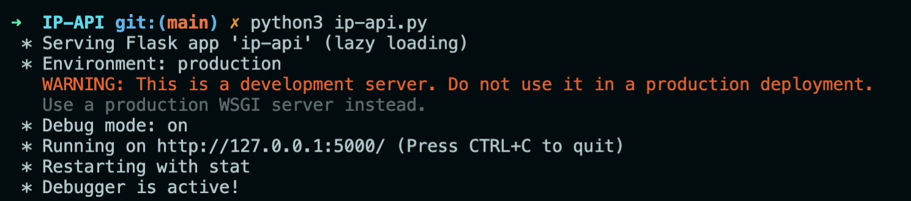
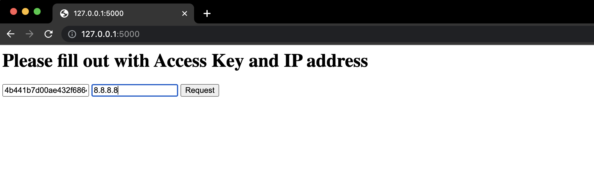

# IP-API

Challenge
```
Construir uma API em Python que responde em qual localização se encontra um determinado IP.
Consultar as informações do IP na IP API, retornar e salvar os valores recebidos.
Criar um endpoint que mostre o histórico dos resultados enviados anteriormente.
```

Installation
```
brew install python3
pip install ipapi
pip install requirements.txt
```

Requirements
```
Python 3.4+
```

Usage

Step 1: Clone do repositório
```
$ git clone https://github.com/araujoajoao/IP-API.git
```

Step 2: Iniciando ambiente 
- Abrir Terminal na pasta raiz da API


- Iniciar API
```
$ python3 ip-api.py
```


Step 3: Executando API e realizando consulta de IP
- Acessar browser /
Access Key: 4b441b7d00ae432f6864810c14136db6 /
IP: 8.8.8.8


Step 5: Consultando histórico de pesquisas /
8.8.8.8/history


References
```
https://ipapi.co/api/?python#location-of-clients-ip
https://ipapi.com
```
